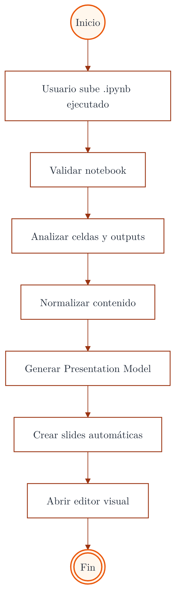
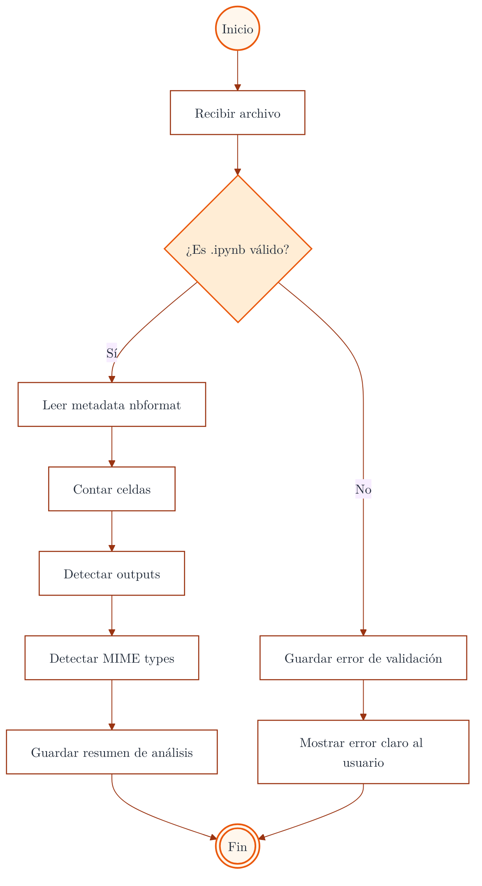
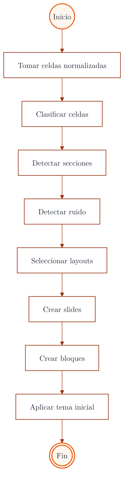
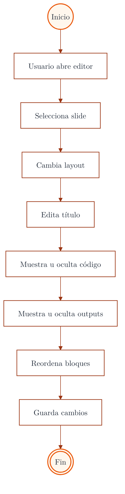
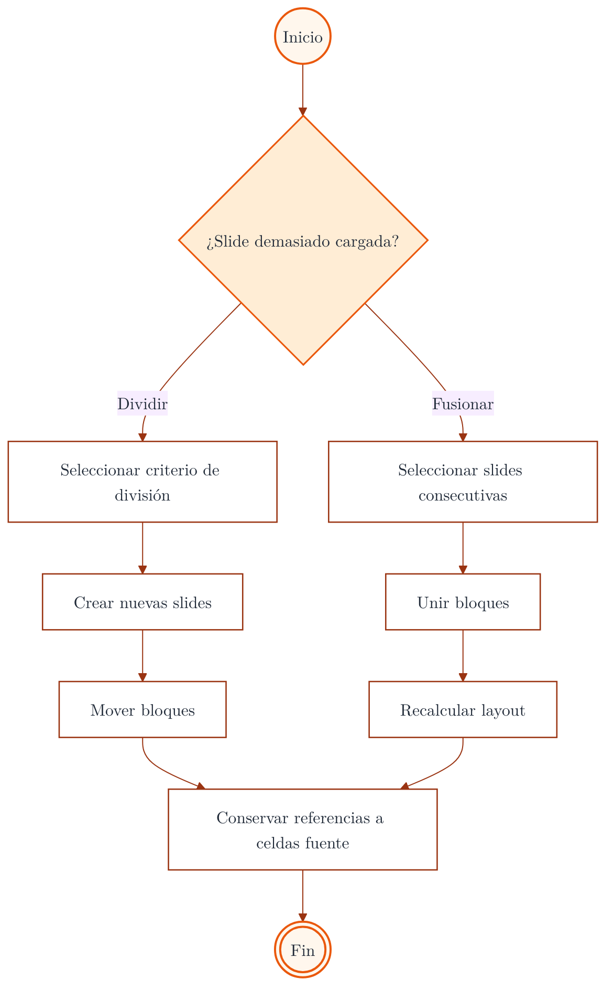
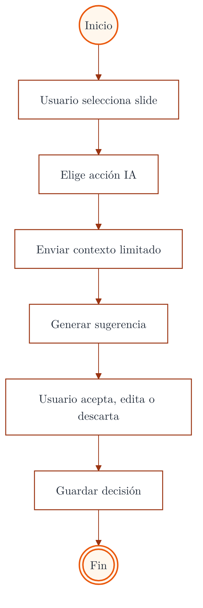
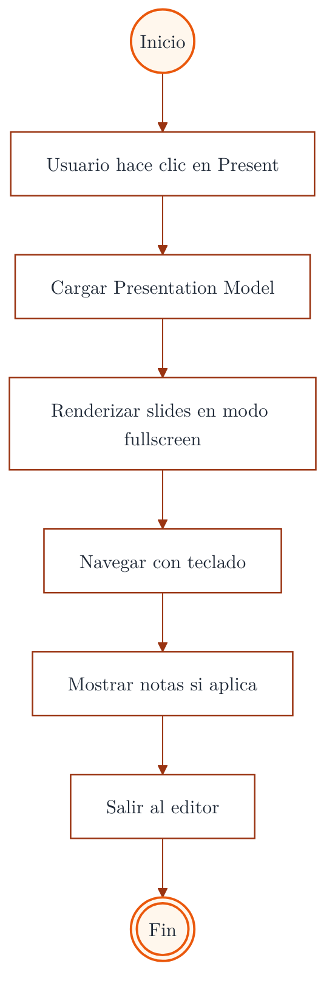
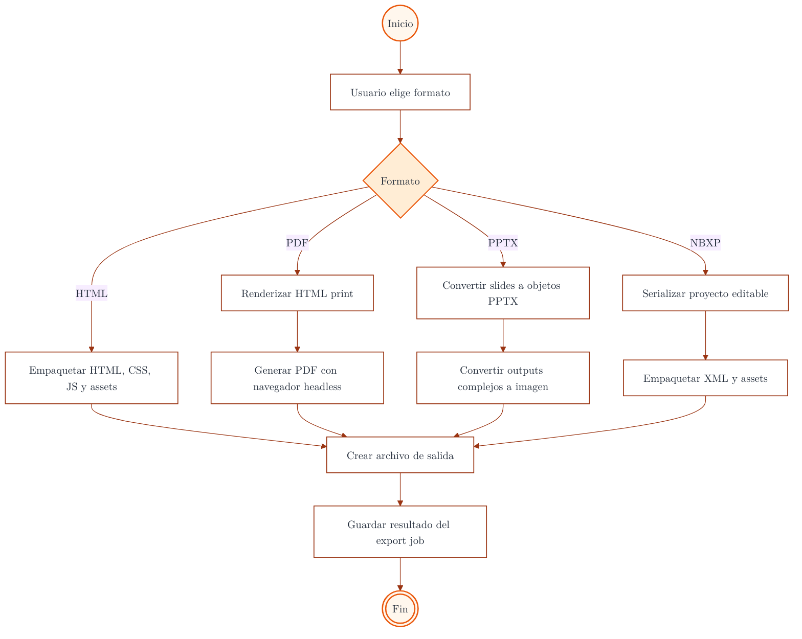
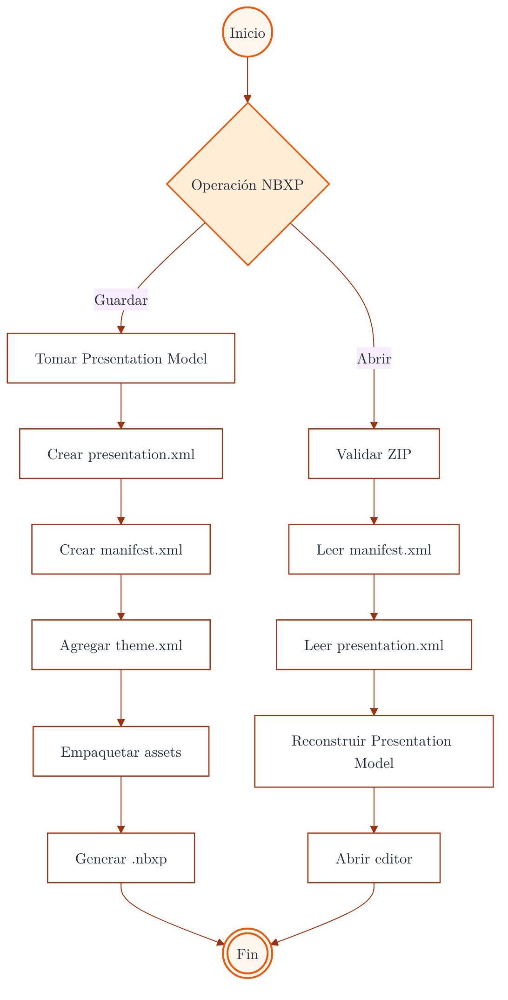
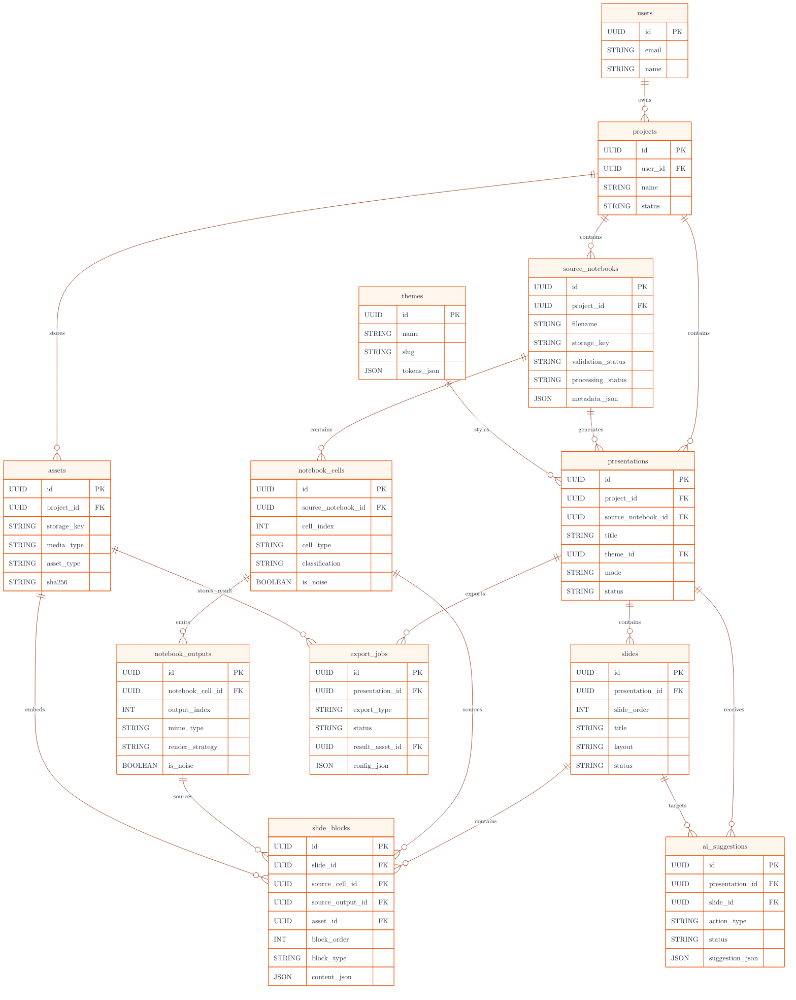

# Tumbfolio

# Tumbfolio: decisiones explícitas de flujo y arquitectura

**Documento técnico en Markdown — estilo Tumbfolio, paleta `#EA580C`, diagramas Mermaid y narrativa de decisiones cerradas.**

Tumbfolio no edita el notebook. Tumbfolio transforma un `.ipynb` ejecutado en un **Presentation Model** propio, permite curarlo visualmente y exporta el resultado a **HTML**, **PDF**, **PPTX** y **NBXP**. Ese principio define la arquitectura del producto, la base de datos, el editor, el modo presentación y el sistema de exportación.

---

## Índice

1. [Flujo principal: de notebook a deck editable](#1-flujo-principal-de-notebook-a-deck-editable)
2. [Validación y análisis del notebook](#2-validación-y-análisis-del-notebook)
3. [Generación automática de slides](#3-generación-automática-de-slides)
4. [Curación manual del deck](#4-curación-manual-del-deck)
5. [Split y merge de slides](#5-split-y-merge-de-slides)
6. [IA asistida](#6-ia-asistida)
7. [Presentación web](#7-presentación-web)
8. [Exportación](#8-exportación)
9. [NBXP](#9-nbxp)
10. [Diagrama relacional simplificado](#10-diagrama-relacional-simplificado)

---

## Convención visual Mermaid

Los diagramas usan una paleta restringida: fondo blanco, grises neutros y naranja Tumbfolio `#EA580C`. El objetivo visual es mantener una lectura sobria, técnica y consistente con una plantilla tipo documento académico-producto.

---

## 1. Flujo principal: de notebook a deck editable

Tumbfolio transformará notebooks ejecutados en un **Presentation Model** propio. El notebook original no será editado. El flujo oficial y obligatorio será cargar un archivo `.ipynb` ejecutado, validar el notebook, analizar celdas y outputs, normalizar contenido, generar el Presentation Model, crear slides automáticas y abrir el editor visual.

Este flujo será la columna vertebral del producto. Toda la arquitectura se alineará con esta secuencia y ninguna funcionalidad secundaria tendrá prioridad sobre su estabilidad.

*Figura 1. Flujo principal: de notebook a presentación editable.*

La base de datos reflejará esta secuencia de forma directa. Primero existirá un `source_notebook`; después, sus `notebook_cells` y `notebook_outputs`; luego, una `presentation`; finalmente, sus `slides` y `slide_blocks`. La IA, el sharing, la colaboración y las optimizaciones posteriores serán capas secundarias sobre este núcleo.

---

## 2. Validación y análisis del notebook

La validación será una etapa independiente del upload. El sistema registrará errores, advertencias, conteos, tipos MIME y trazabilidad técnica desde el primer momento. Esta decisión evita que el procesamiento del notebook quede mezclado con la recepción del archivo.

`source_notebooks` almacenará `validation_status`, `validation_errors`, `validation_warnings`, `cell_count`, `output_count`, `detected_mime_types`, `file_size_bytes` y `sha256`. El sistema deberá poder explicar por qué una generación falló, por qué un notebook fue rechazado o qué tipo de contenido fue detectado antes de crear el deck.

*Figura 2. Flujo de validación y análisis del notebook.*

Los notebooks corruptos, vacíos, sin outputs, con formatos anómalos o demasiado pesados se tratarán como casos de validación, no como errores genéricos del sistema. Esta separación hará que los mensajes al usuario sean específicos y que los diagnósticos internos sean auditables.

---

## 3. Generación automática de slides

La generación automática no será una traducción mecánica de una celda por slide. El sistema clasificará celdas, detectará secciones, filtrará ruido, elegirá layouts y construirá slides y bloques con referencias al origen.

`notebook_cells` y `notebook_outputs` conservarán clasificación, ruido y estrategia de render. `slides` y `slide_blocks` conservarán la trazabilidad al contenido fuente. Esta decisión permite que un gráfico, una tabla, una celda de código o un bloque narrativo siempre pueda rastrearse hasta su origen.

*Figura 3. Flujo de generación automática del deck.*

La generación automática será responsable de separar narrativa, setup, resultados relevantes, logs, outputs complejos y material de apéndice. Un notebook real suele mezclar exploración, código desechable, pruebas intermedias y resultados finales; por eso el modelo no asumirá que cada celda merece una slide propia.

---

## 4. Curación manual del deck

El usuario editará la presentación generada y no el notebook original. El editor permitirá cambiar layout, editar títulos, mostrar u ocultar código, mostrar u ocultar outputs, reordenar bloques y guardar cambios.

La persistencia se resolverá en `slides` y `slide_blocks`, con soporte de configuración de visibilidad por bloque o por slide. Esta separación mantiene el notebook como fuente y el deck como producto curado.

*Figura 4. Flujo de curación manual de slides.*

El producto no se convertirá en un pseudo-Jupyter. El editor tendrá como unidad de trabajo la presentación, no el notebook. La trazabilidad con la fuente se mantendrá en el modelo, pero la intención de edición será producir una presentación clara, no reescribir el análisis original.

---

## 5. Split y merge de slides

Dividir y fusionar slides serán operaciones oficiales del modelo, no simples efectos visuales del editor. Al dividir una slide, los bloques existentes se redistribuirán sin perder su identidad. Al fusionar, los bloques se combinarán y se recalculará el layout.

`slide_blocks` conservará IDs estables, orden explícito y referencias opcionales a `notebook_cells`, `notebook_outputs` y `assets`. No se duplicarán datos pesados al mover bloques.

*Figura 5. Flujo de split y merge de slides.*

Split y merge no crearán contenido nuevo por defecto. Redistribuirán o combinarán bloques existentes. La identidad técnica del bloque sobrevivirá a los movimientos, porque de ella dependen el render, la exportación, NBXP y las sugerencias de IA.

---

## 6. IA asistida

La IA actuará exclusivamente como asistente de curación. Podrá proponer títulos, resúmenes, speaker notes y sugerencias de visibilidad, pero no modificará métricas, tablas, gráficos ni outputs originales sin confirmación explícita del usuario.

`ai_suggestions` almacenará `action_type`, contexto enviado, sugerencia recibida y estado final: `accepted`, `edited` o `rejected`. La sugerencia será un objeto auditable, no una modificación silenciosa del contenido.

*Figura 6. Flujo de IA como asistente de curación.*

La IA no será el motor de verdad del producto. Su función será mejorar la presentación, no alterar los resultados del notebook. Esta frontera evita que el sistema fabrique contenido, rompa la fidelidad técnica o degrade la confianza del usuario.

---

## 7. Presentación web

HTML será el formato canónico del producto. La presentación web cargará el Presentation Model y renderizará las slides en modo fullscreen. PDF y PPTX serán derivados del render web.

No se creará un modelo paralelo para `present mode`; presentar significará leer correctamente `presentations`, `slides`, `slide_blocks`, `assets` y `themes`.

*Figura 7. Flujo de presentación web.*

La prioridad visual del producto será que el deck se vea excelente en web. El PDF será una salida impresa del render web y PPTX será una aproximación editable o semieditable según la complejidad de los bloques.

---

## 8. Exportación

Toda exportación se ejecutará como `export_job` con tipo, estado, configuración y resultado. HTML empaquetará HTML, CSS, JS y assets. PDF se generará desde HTML print con navegador headless. PPTX convertirá slides a objetos PPTX y degradará outputs complejos a imagen cuando sea necesario. NBXP serializará el proyecto editable.

`presentations` no almacenará columnas sueltas como `last_pdf_url`, `last_html_url` o `last_pptx_url`. Cada exportación será un evento persistente con su propia configuración, estado, errores y archivo resultante.

*Figura 8. Flujo de exportación de presentación.*

La exportación podrá ser síncrona en el MVP, pero se modelará como job desde el inicio. Esta decisión evita rediseñar la persistencia cuando aparezcan archivos grandes, errores de render, colas de procesamiento o exportaciones concurrentes.

---

## 9. NBXP

NBXP será el formato editable del producto. Guardará y reabrirá proyectos curados sin depender permanentemente del `.ipynb` original. Internamente incluirá `manifest.xml`, `presentation.xml`, `theme.xml` y assets.

En base de datos, el archivo NBXP se gestionará como `asset` asociado a una `presentation` y, cuando aplique, a un `export_job`, con versión y validación registradas.

*Figura 9. Flujo de guardar y abrir NBXP.*

NBXP no será un export final equivalente a PDF. Será el formato portable y editable de Tumbfolio. Su propósito será transportar un proyecto curado, reabrirlo, editarlo y volverlo a exportar.

---

## 10. Diagrama relacional simplificado

El núcleo del sistema quedará definido por la cadena `source_notebooks → notebook_cells → notebook_outputs → presentations → slides → slide_blocks`. `slide_blocks` será la pieza de unión entre el mundo fuente y el mundo presentación.

La base de datos conservará trazabilidad desde el archivo cargado hasta cada bloque visible del deck. Las entidades secundarias (`assets`, `themes`, `export_jobs` y `ai_suggestions`) se conectarán al núcleo sin reemplazarlo.

*Figura 10. Modelo de base de datos relacional simplificado.*

Este modelo no intenta cubrir colaboración, permisos avanzados, versionamiento exhaustivo ni publicación pública. Esas capacidades podrán agregarse después. La decisión correcta para el MVP es cerrar primero el núcleo: importar notebook, analizarlo, generar deck, curarlo, presentarlo, exportarlo y reabrirlo como NBXP.

---

## Cierre técnico

Tumbfolio quedará construido sobre una separación estricta entre fuente y presentación. El `.ipynb` será la fuente ejecutada. El **Presentation Model** será el producto editable. Los `slide_blocks` mantendrán la conexión entre ambos mundos. Los exports serán derivados del modelo, no sustitutos del modelo.

Esta arquitectura evita convertir el producto en un editor de notebooks mediocre y lo posiciona como una herramienta especializada para transformar análisis ejecutados en presentaciones profesionales, trazables y portables.
